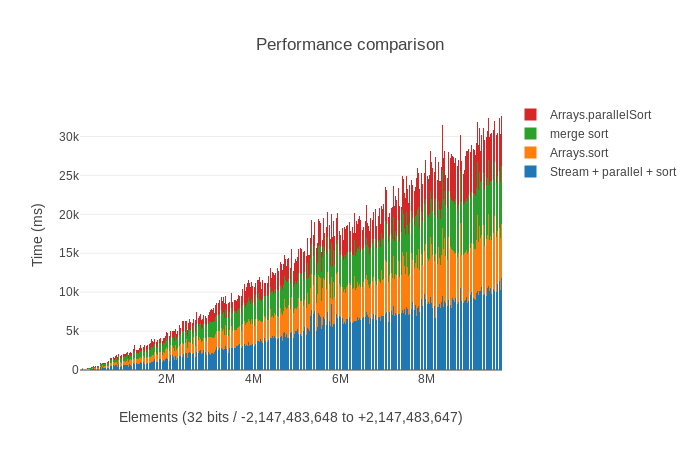

[](https://stackshare.io/graphai/graphai) [](https://paypal.me/martibayoalemany)

# Algorithms / programming languages

[Languages ranking](http://spectrum.ieee.org/static/interactive-the-top-programming-languages-2017)

## Statistics with jupyter

```
source scripts/activate
# Setups the python environment accordingly 
cd stats
jupyter notebook

```

## Sorting algorithms and java
TO-FIX: Stream + Parallel + Sort - timing is not the real one 

TO-DO: sqlite3 with an index sorts faster than java in memory, check the basics for data and in-memory solutions

 

[Pyplot stats for java and sorting](stats/Java_sorting.md)

## Continuous integration
* *.travis.yml* for travis in github
* *.gitlab-ci.xml* for gitlab

## Results

### Binary gap stats 
```
scripts/stat_algs.sh
```

```
real 0:00.00    user 0.00        sys 0.00       c
real 0:00.00    user 0.00        sys 0.00       perl
real 0:00.02    user 0.01        sys 0.00       php7
real 0:00.06    user 0.06        sys 0.00       python
real 0:00.09    user 0.08        sys 0.00       ruby
real 0:00.11    user 0.08        sys 0.02       c_sharp
real 0:00.13    user 0.11        sys 0.00       nodejs
real 0:00.13    user 0.10        sys 0.02       java
real 0:00.39    user 0.33        sys 0.04       perl6
real 0:00.31    user 0.23        sys 0.15       octave
real 0:00.61    user 0.58        sys 0.01       nodejs_slow
```


### ArrayList vs LinkedList (Java)
####  ArrayList
```
initialization [46,717,000 ns]
Removing 10,000 elements 10,000 -> 20,000  [661,835,000 ns]
Removing 10,000 elements 100,000 -> 110,000  [39,749,000 ns]
Removing 10,000 elements 200,000 -> 210,000  [658,547,000 ns]
```

#### LinkedList
According to the documentation a LinkedList is a doubly linked list

```
initialization [122,772,000 ns]
Removing 10,000 elements 10,000 -> 20,000  [351,818,000 ns]
Removing 10,000 elements 100,000 -> 110,000  [139,877,000 ns]
Removing 10,000 elements 200,000 -> 210,000  [423,006,000 ns]
```

### Compile  (C)
```
gcc BinaryGap.c -o BinaryGap -lm
```

```
sudo apt install cmake
cd main/c
cmake .
make
```

### Compile (dotnet)
```
sudo sh -c 'echo "deb [arch=amd64] https://apt-mo.trafficmanager.net/repos/dotnet-release/ xenial main" > /etc/apt/sources.list.d/dotnetdev.list'
sudo apt-key adv --keyserver hkp://keyserver.ubuntu.com:80 --recv-keys 417A0893
sudo apt-get update
```
```
sudo apt install dotnet-dev-2.0.0-preview1-005977
```

### Creates a new app (dotnet)
```
dotnet new console -o src/main/cs
dotnet restore
dotnet run
```


### Gradle and ubuntu 17
There seems to be some issues with tgetent which get solved by installing libnative-jni manually
```
usr/lib/jni/libnative-platform-curses.so: undefined symbol: tgetent
sudo -s dpkg -i libnative-platform-jni_0.11-5_amd64.deb
```

Otherwise this command should update to the latest version of gradle. This solved the previous error in a clean system.
```
gradlew
```
